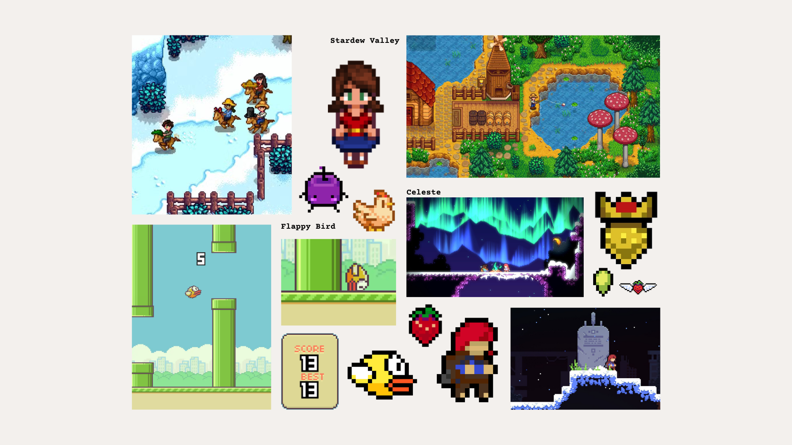

# utuTenis - Documento de Diseño de Juego (GDD)

**Integrantes:**
* Manuel Sainz
* Maia Oldak
* Iván Castro

**Correos de los integrantes:**
* manuelsainz6@gmail.com
* maiaoldak2001@gmail.com
* ivan10czr@gmail.com

**Versión:** 1.0.3

**Fecha:** 2025-11-06

---

## 1. Resumen Ejecutivo

* **Título del Juego:** utuTenis
* **Género:** Deporte
* **Plataforma(s) Objetivo:** PC
* **Público Objetivo:** Jugadores casuales, para jugadores de 8+ años.
* **Propuesta Única de Venta (USP):** Tenis rápido, accesible y divertido con controles simples, ideal para partidas cortas en solitario o entre amigos en el mismo dispositivo.

---

## 2. Concepto del Juego

### 2.1. Visión General
utuTenis es un juego de tenis en 2D donde los jugadores controlan personajes simples y coloridos en partidos cortos. Su objetivo es capturar la emoción del tenis, pero con una jugabilidad ligera, divertida y accesible.

### 2.2. Pilares de Diseño

* **Accesibilidad:** Controles simples, fáciles de aprender.
* **Competitividad:** Enfrentamientos jugador contra jugador en la misma pantalla.
* **Ritmo Ágil:** Partidas cortas que generan emoción inmediata.

### 2.3. Inspiraciones y Referencias

* Juegos de tenis como Mario Tennis Open y Virtua Tennis.
* Mini-juegos deportivos en Wii Sports.
* Estilo visual simple y colorido, inspirado en pixel art.

---

## 3. Mecánicas de Juego (Gameplay)

### 3.1. Bucle de Jugabilidad Principal (Core Gameplay Loop)

* **Acción 1:** El jugador se mueve para interceptar la pelota.
* **Acción 2:** El jugador golpea la pelota.
* **Acción 3:** El jugador reacciona al contraataque del oponente.
* **Recompensa:** El jugador obtiene puntos para ganar el partido.

### 3.2. Mecánicas Detalladas

* **Movimiento del Jugador:** Movimiento en 4 direcciones (arriba, abajo, izquierda, derecha) y golpe de pelota.
* **Sistema de Puntos:** Reglas simples (primer jugador en llegar a 2 sets gana).
* **Modo 1 Jugador:** El jugador se enfrenta a una IA básica.
* **Modo 2 Jugadores:** Competencia local en el mismo dispositivo.

### 3.3. Controles

| Acción | Teclado (Modo 1 Jugador) | Teclado (Jugador 1) | Teclado (Jugador 2) |
| :--- | :--- | :--- | :--- |
| Moverse | Flechas | W A S D | Flechas |
| Golpear | Barra Espaciadora | V | L |
| Pausa | Esc | Esc | Esc |

---

## 4. Mundo y Narrativa

### 4.1. Historia y Argumento
El juego no se centra en una narrativa, sino en la experiencia del enfrentamiento en partidos de tenis amistosos.

### 4.2. Personajes

* **Jugador 1 / Jugador 2:**
* **Rol:** Jugador de tenis (a elección).
* **Descripción:** Personalidad alegre y competitiva.

### 4.3. Entorno y Niveles

* **Cancha Principal:**
* **Descripción Visual:** Pixel art 2D simple y colorido.
* **Objetivos:** Lograr 2 sets para ganar la partida.

---

## 5. Arte y Sonido

### 5.1. Dirección de Arte

* **Estilo:** Pixel Art.
* **Paleta de Colores:** Colores vibrantes.
* **Inspiración Visual:** Stardew Valley, Flappy Bird y Celeste.

### 5.2. Diseño de Sonido y Música

* **Música:** Bucles con melodías alegres.
* **Efectos de Sonido (SFX):** Clic del mouse, rebote y golpe de pelota, sonidos en el Game Over que reflejan el resulato de la partida.

---

## 6. Interfaz de Usuario (UI) y Experiencia de Usuario (UX)

### 6.1. Flujo de Pantallas

* **Modo 1 Jugador:** Pantalla de Título -> Selección cantidad de jugadores -> Selección de Personaje -> Muestra Controles -> Juego* -> Game Over
* **Modo 2 Jugadores:** Pantalla de Título -> Selección cantidad de jugadores -> Selección del primer Personaje -> Selección del segundo Personaje -> Muestra Controles -> Juego* -> Game Over

### 6.2. HUD (Heads-Up Display)

* Marcador de puntos.

### 6.3. Menús

* **Menú Principal:** Título y la opción de continuar para empezar una partida.
* **Pausa:** Opciones de volver al menú principal y salir del juego.
* **Game Over:** Resultado del partido y opciones de volver al menú principal y salir del juego.

---

## 7. Plan de Producción y Monetización

### 7.1. Hoja de Ruta (Roadmap)

* **Prototipo:** Septiembre 2025 - Flujo completo del menú pricipal.
* **Vertical Slice:** Octubre 2025 - Movimiento, colisiones y golpe básico.
* **Alfa:** Octubre 2025 - Flujo completo de partida.
* **Beta:** Noviembre 2025 - Testeo de bugs y ajustes finales.
* **Lanzamiento:** Noviembre 2025

### 7.2. Modelo de Monetización

* Free-to-Play.

---

## 8. Fuentes de los Assets

| ID del Asset | Descripción del Asset | Tipo | Origen/Fuente (URL) | Licencia | Costo | Notas de Atribución |
| :--- | :--- | :--- | :--- | :--- | :--- | :--- |
| MUS-001 | Música del menú principal | Audio | [https://pixabay.com/sound-effects/game-music-loop-7-145285/](https://pixabay.com/sound-effects/game-music-loop-7-145285/) | Licencia de Contenido de Pixabay | Gratis | "Game Music Loop 7" por XtremeFreddy |
| MUS-002 | Música del modo de juego | Audio | [https://pixabay.com/sound-effects/game-music-loop-6-144641/](https://pixabay.com/sound-effects/game-music-loop-6-144641/) | Licencia de Contenido de Pixabay | Gratis | "Game Music Loop 6" por XtremeFreddy |
| SFX-001 | Sonido de golpe de pelota | Audio | [https://pixabay.com/sound-effects/tennis-ball-hit-151257/](https://pixabay.com/sound-effects/tennis-ball-hit-151257/) | Licencia de Contenido de Pixabay | Gratis | "Tennis Ball Hit" por SoundReality |
| SFX-002 | Sonido de rebote de pelota | Audio | [https://pixabay.com/sound-effects/tennisballbounce-39028/](https://pixabay.com/sound-effects/tennisballbounce-39028/) | Licencia de Contenido de Pixabay | Gratis | "TennisBallBounce" por freesound_community |
| SFX-003 | Sonido de clic del mouse | Audio | [https://pixabay.com/sound-effects/mouse-click-290204/](https://pixabay.com/sound-effects/mouse-click-290204/) | Licencia de Contenido de Pixabay | Gratis | "Mouse click" por Matthew Vakalyuk |
| SFX-004 | Sonido “Victoria” (modo 1 jugador)  | Audio | [https://pixabay.com/sound-effects/crowd-cheers-314921/](https://pixabay.com/sound-effects/crowd-cheers-314921/) | Licencia de Contenido de Pixabay | Gratis | "Crowd Cheers" por storegraphic |
| SFX-005 | Sonido “Derrota” (modo 1 jugador)  | Audio | [https://pixabay.com/sound-effects/losing-horn-313723/](https://pixabay.com/sound-effects/losing-horn-313723/) | Licencia de Contenido de Pixabay | Gratis | "Losing Horn" por u_l5xum8z250 |
| SFX-006 | Sonido “Game Over” (modo 2 jugadores)  | Audio | [https://pixabay.com/sound-effects/level-up-05-326133/](https://pixabay.com/sound-effects/level-up-05-326133/) | Licencia de Contenido de Pixabay | Gratis | "Level Up 05" por Universfield |
| FNT-001 | Fuente para títulos | Fuente | [https://www.dafont.com/super-pixel.font](https://www.dafont.com/super-pixel.font) | Libre para uso personal | Gratis | "Super Pixel" por fsuarez913 |
| FNT-002 | Fuente para textos | Fuente | [https://www.dafont.com/minecraft.font](https://www.dafont.com/minecraft.font) | Libre para uso personal | Gratis | "Minecraft" por Craftron Gaming |
| FNT-003 | Fuente para marcador de puntos y avisos | Fuente | [https://www.dafont.com/pixelmix.font](https://www.dafont.com/pixelmix.font) | Libre para uso personal | Gratis | "PixelMix" por Andrew Tyler |
| IMG-001 | Imagen base para personaje | Imagen | [https://www.shutterstock.com/es/image-vector/vector-pixel-art-tennis-girl-isolated-733664059](https://www.shutterstock.com/es/image-vector/vector-pixel-art-tennis-girl-isolated-733664059) | Derechos Reservados | Gratis | "Vector pixel art tennis girl isolated" por saphatthachat pixel art |
| IMG-002 | Imagen base para personaje | Imagen | [https://www.shutterstock.com/es/image-vector/vector-pixel-art-tennis-man-isolated-733663504](https://www.shutterstock.com/es/image-vector/vector-pixel-art-tennis-man-isolated-733663504) | Derechos Reservados | Gratis | "Vector pixel art tennis man isolated" por saphatthachat pixel art |
&nbsp;

Todos los spritesheets y elementos visuales del juego fueron creados internamente.

**Nota:** El diseño de los personajes se deriva de dos imágenes base no propias (IMG-001 e IMG-002).

Se realizaron ajustes en los colores, la raqueta y la animación de las piernas para simular el movimiento de los personajes y adaptarlos al estilo visual del juego.

---

## 9. Control de Cambios

| Versión | Fecha | Autor del Cambio | Descripción del Cambio | Razón del Cambio |
| :--- | :--- | :--- | :--- | :--- |
| 1.0.0 | 2025-10-03 | Maia Oldak | Creación inicial del documento. | Inicio del proyecto. |
| 1.0.1 | 2025-10-14 | Iván Castro | Se actualizó la sección 3.3. | Se cambiaron los controles para mejorar la jugabilidad. |
| 1.0.2 | 2025-10-20 | Manuel Sainz | Se actualizó la sección 8. | Se agregaron más efectos de sonido y fuentes. |
| 1.0.3 | 2025-11-06 | Maia Oldak | Se actualizó la sección 5.1. | Se agregó un moodboard para visualizar mejor el estilo. |
